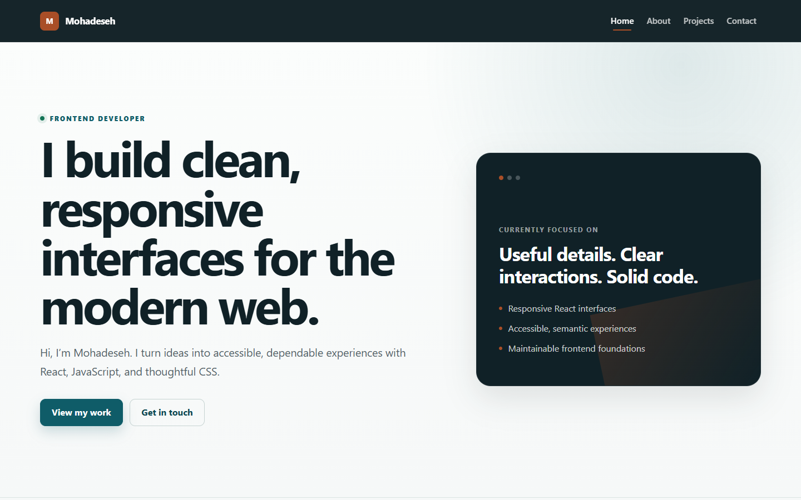
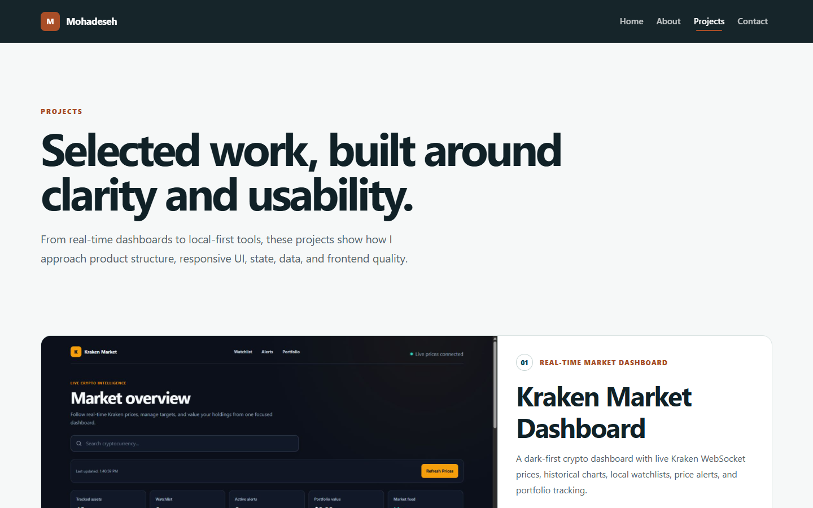
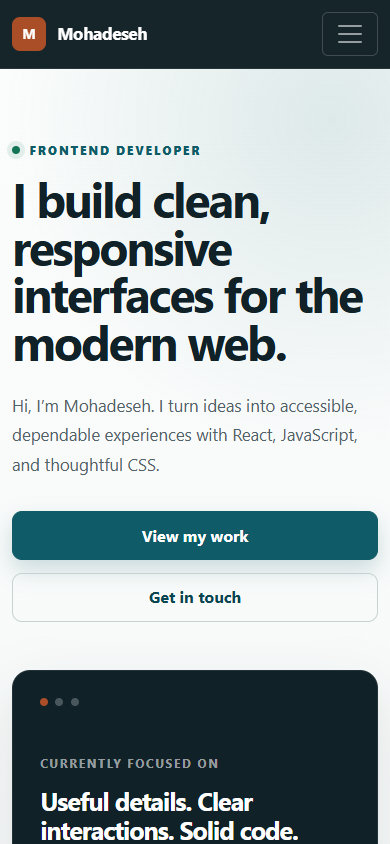

# Mohadeseh — Frontend Developer Portfolio

## Overview

A clean, responsive portfolio for Mohadeseh, a frontend developer focused on
accessible React interfaces. The site introduces her experience, presents a
curated collection of projects, and includes a polished client-side contact
experience.

## Features

- Responsive navigation, page layouts, project cards, and footer
- Curated project gallery with live-demo and source-code links
- Accessible landmarks, keyboard focus states, skip navigation, and form errors
- Client-side contact form validation with loading and success states
- Route-aware page titles and a custom not-found page
- Subtle motion with reduced-motion support
- GitHub Pages deployment workflow with SPA route fallback

## Tech Stack

- React 19
- React Router 7
- React Bootstrap 2 and Bootstrap 5
- Create React App / React Scripts 5
- CSS
- GitHub Actions and GitHub Pages

## Pages

| Route | Description |
| --- | --- |
| `/` | Introduction, core strengths, and featured work |
| `/about` | Background, working principles, skills, and tools |
| `/projects` | Selected frontend projects with technology details |
| `/contact` | Validated client-side contact experience |
| `*` | Custom not-found page with a route back home |

## Screenshots

| Home | Projects |
| --- | --- |
|  |  |

<p align="center">
  
</p>

## Installation

Node.js 20 and npm 10 are recommended.

```bash
git clone https://github.com/mohadesehesmaeilzadeh/personal-website.git
cd personal-website
npm ci
npm start
```

The development server runs at `http://localhost:3000`.

## Build

Create an optimized production build:

```bash
npm run build
```

The generated site is written to `build/`. Pushes to `master` can deploy this
directory through `.github/workflows/deploy-pages.yml`.

## Live Demo

[View the portfolio on GitHub Pages](https://mohadesehesmaeilzadeh.github.io/personal-website/)
